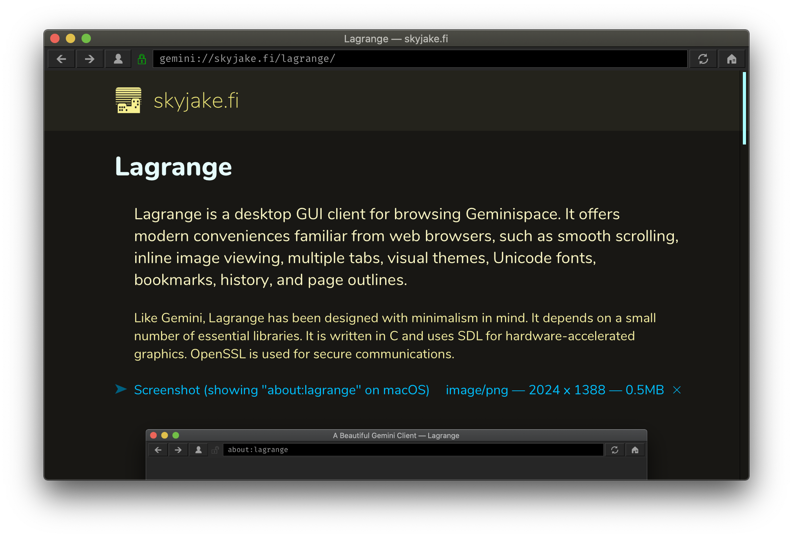

# Lagrange

Lagrange is a desktop GUI client for browsing [Geminispace](https://gemini.circumlunar.space/). It offers modern conveniences familiar from web browsers, such as smooth scrolling, inline image viewing, multiple tabs, visual themes, Unicode fonts, bookmarks, history, and page outlines.

Like Gemini, Lagrange has been designed with minimalism in mind. It depends on a small number of essential libraries. It is written in C and uses [SDL](https://libsdl.org/) for hardware-accelerated graphics. [OpenSSL](https://openssl.org/) is used for secure communications.



## Features

* Beautiful typography using Unicode fonts
* Autogenerated page style and Unicode icon for each Gemini domain
* Smart suggestions when typing the URL — search bookmarks, history, identities
* Sidebar for page outline, managing bookmarks and identities, and viewing history
* Multiple tabs
* Identity management — create and use TLS client certificates
* Audio playback: MP3, Ogg Vorbis, WAV
* And more! Open `about:help` in the app, or see [help.gmi](https://git.skyjake.fi/skyjake/lagrange/raw/branch/release/res/about/help.gmi)

## Downloads

Prebuilt binaries for Windows and macOS can be found in [Releases][rel].

## How to compile

This is how to build Lagrange in a Unix-like environment. The required tools are a C11 compiler (e.g., Clang or GCC), CMake and `pkg-config`.

1. Download and extract a source tarball from [Releases][rel]. Alternatively, you may also clone the repository and its submodules: `git clone --recursive --branch release https://git.skyjake.fi/skyjake/lagrange`
2. Check that you have the required dependencies installed: CMake, SDL 2, OpenSSL 1.1.1, libpcre, zlib, libunistring. For example, on macOS this would do the trick (using Homebrew): ```brew install cmake sdl2 openssl@1.1 pcre libunistring``` Or on Ubuntu: ```sudo apt install cmake libsdl2-dev libssl-dev libpcre3-dev zlib1g-dev libunistring-dev```
3. Optionally, install the mpg123 decoder library for MPEG audio support. For example, the macOS Homebrew package is `mpg123` and on Ubuntu it is `libmpg123-dev`.
4. Create a build directory.
5. In your empty build directory, run CMake: ```cmake {path_of_lagrange_sources} -DCMAKE_BUILD_TYPE=Release```
6. Build it: ```cmake --build .```
7. Now you can run `lagrange`, `lagrange.exe`, or `Lagrange.app`.

### Installing to a directory

To install to "/dest/path":

1. `cmake {path_of_lagrange_sources} -DCMAKE_INSTALL_PREFIX=/dest/path`
2. `cmake --build . --target install`

This will also install an XDG .desktop file for launching the app.

### Compiling on macOS

When using OpenSSL 1.1.1 from Homebrew, you must add its pkgconfig path to your `PKG_CONFIG_PATH` environment variable, for example:

    export PKG_CONFIG_PATH=/usr/local/Cellar/openssl@1.1/1.1.1h/lib/pkgconfig

Also, SDL's trackpad scrolling behavior on macOS is not optimal for regular GUI apps because it emulates a physical mouse wheel. This may change in a future release of SDL, but at least in 2.0.12 a [small patch](https://git.skyjake.fi/skyjake/lagrange/raw/branch/dev/sdl2-macos-mouse-scrolling-patch.diff) is required to allow momentum scrolling to come through as single-pixel mouse wheel events. Note that SDL comes with an Xcode project; use the "Shared Library" target and check that you are doing a Release build.

### Compiling on Windows

Windows builds require [MSYS2](https://www.msys2.org). In theory, [Clang](https://clang.llvm.org/docs/MSVCCompatibility.html) or GCC (on [MinGW](http://mingw.org)) could be set up natively on Windows for compiling everything, but the_Foundation still lacks native Win32 implementations for the Socket and Process classes and these are required by Lagrange.

You should use the SDL 2 library precompiled for native Windows (the MSVC variant) instead of the version from MSYS2 or MinGW. You can download a copy of the SDL binaries from https://libsdl.org/. To make configuration easier in your MSYS2 environment, consider writing a custom sdl2.pc file so `pkg-config` can automatically find the correct version of SDL. Below is an example of what your sdl2.pc might look like:

```
prefix=/c/SDK/SDL2-2.0.12/
arch=x64
libdir=${prefix}/lib/${arch}/
incdir=${prefix}/include/

Name: sdl2
Description: Simple DirectMedia Layer
Version: 2.0.12-msvc
Libs: ${libdir}/SDL2.dll -mwindows
Cflags: -I${incdir}
```

The *-mwindows* option is particularly important as that specifies the target is a GUI application. Also note that you are linking directly against the Windows DLL — do not use any prebuilt .lib files if available, as those as specific to MSVC.

`pkg-config` will find your .pc file if it is on `PKG_CONFIG_PATH` or you place it in a system-wide pkgconfig directory.

Once you have compiled a working binary under MSYS2, there is still an additional step required to allow running it directly from the Windows shell: the shared libraries from MSYS2 must be found either via `PATH` or by copying them to the same directory where `lagrange.exe` is located.

### Compiling on Raspberry Pi

You should use a version of SDL that is compiled to take advantage of the Broadcom VideoCore OpenGL ES hardware. This provides the best performance when running Lagrange in a console.

At present time, OpenGL under X11 on Raspberry Pi is still quite slow/experimental. When running under X11, software rendering is the best choice and the SDL from Raspbian etc. is sufficient.

The following build options are recommended on Raspberry Pi:

* `ENABLE_KERNING=NO`: faster text rendering without noticeable loss of quality
* `ENABLE_WINDOWPOS_FIX=YES`: workaround for window position restore issues (SDL bug)
* `ENABLE_X11_SWRENDER=YES`: use software rendering under X11

[rel]: https://git.skyjake.fi/skyjake/lagrange/releases
[tf]:  https://git.skyjake.fi/skyjake/the_Foundation
